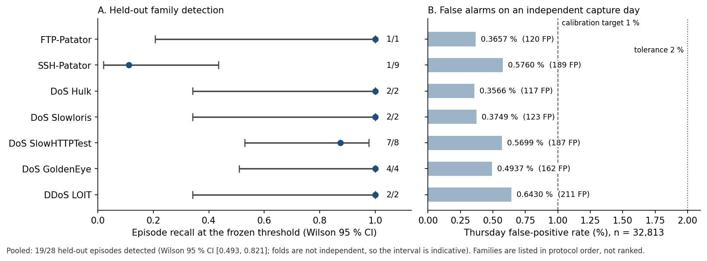
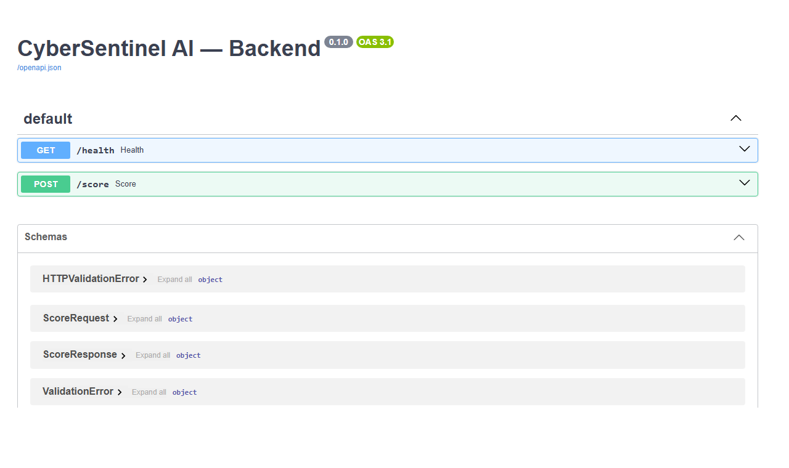
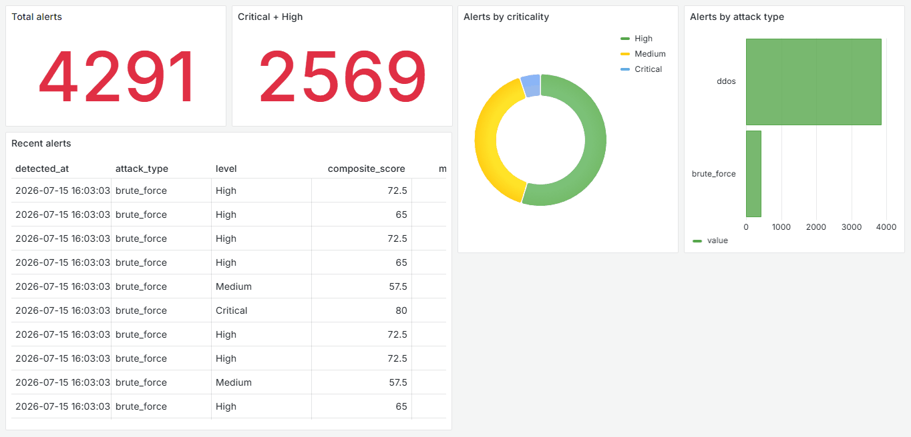

# CyberSentinel AI


[](https://github.com/An4ss3/CybersSentinel-AI/actions/workflows/tests.yml)


**A machine-learning network intrusion detection pipeline built from raw packet
captures, with a reproducible, pre-specified evaluation of cross-family attack
transfer on CICIDS2017.**

[Results](#headline-result) · [Architecture](#architecture) ·
[Methodology](#machine-learning-methodology) · [My contribution](#my-contribution) ·
[Reproducibility](#reproducibility-and-integrity) · [Limitations](#limitations)

CyberSentinel AI was developed during an engineering internship at Mohammed VI
Polytechnic University (UM6P, Rabat), as part of the Computer Science, AI and
Digital Trust engineering programme of ENSA Fès. It is a research prototype,
not a production IDS.

## Project at a glance

| | |
|---|---|
| **Type** | Research / engineering prototype |
| **Domain** | Machine learning for network security |
| **Core task** | Network intrusion detection, evaluated on cross-family transfer |
| **Data** | CICIDS2017 raw PCAPs (5 capture days, ~48.8 GiB), not redistributed |
| **Network analysis** | Zeek 8.0.9, digest-pinned container, offline replay |
| **Main model** | Random Forest on 5 volume features (VOL5) |
| **Exploratory models** | XGBoost; content features (ARM F) on one held-out family |
| **Demonstration layer** | FastAPI scoring API, PostgreSQL alert table, Grafana dashboard |
| **Infrastructure** | Docker Compose |
| **Validation** | Protocol fixed before evaluation, SHA-256-pinned artifacts, fresh-clone re-execution, CI on every push |

The project asks one precise question:

> Can a detector trained on six attack families detect a **seventh family that
> was entirely absent from training and threshold calibration**, while keeping
> false alarms low and the evaluation reproducible?

Most of the work went into making the answer *defensible*: rebuilding the data
from raw PCAPs instead of using pre-computed features, refusing to label
uncertain traffic as benign, separating the model from its decision threshold,
fixing the protocol before opening the test data, and pinning every artifact by
SHA-256.

---

## Headline result



Seven leave-one-family-out experiments on CICIDS2017, with a 5-feature
volumetric representation and a fixed Random Forest:

- **19 of 28 held-out attack episodes detected** (pooled episode recall 0.679,
  Wilson 95 % CI [0.493, 0.821]).
- **False-positive rate below 1 % on all seven folds** (0.357 %–0.643 %),
  measured on 32,813 benign windows from a capture day never used for training
  or calibration.
- **Transfer is heterogeneous.** Five families reach 100 % episode recall, but
  each rests on 1 to 4 episodes; SSH-Patator is a clear failure (1/9) and is
  kept visible as a counter-example.

These numbers describe this protocol on this corpus. They are **not** evidence
of general-purpose or "zero-day" detection — see [Limitations](#limitations).
The figure is regenerated from the frozen artifact by
`scripts/plot_transfer_results.py`.

---

## What is implemented

| Component | Status |
|---|---|
| PCAP freeze → deterministic Zeek replay → canonical events → 60 s windows → labels | **Implemented and verified**, every stage pinned by SHA-256 |
| Leave-one-family-out transfer experiment (7 folds) | **Implemented, executed, and re-executed from a fresh clone with identical models and results** |
| Exploratory study on a held-out botnet family (Ares) | **Implemented**; secondary, outside the main protocol |
| FastAPI scoring service, PostgreSQL alert store, Grafana dashboard | **Implemented** as a demonstration prototype, outside the experimental protocol |
| Elasticsearch, Kibana, Redis | Containers declared in `docker-compose.yml`; **not integrated in the code** |
| LLM assistant, threat-intelligence enrichment, malware detection | Planned in the [initial specification](docs/specification/README.md); **not implemented** |

## Architecture

```text
 CICIDS2017 PCAPs (frozen, SHA-256 pinned)
            │
            ▼
 Zeek 8.0.9 replay ─ digest-pinned container, offline, single process, UTC
            │  conn.log
            ▼
 Normalisation ─ admission contract, exact decimal time, explicit rejections
            │  canonical network events
            ▼
 60-second windows per entity  (source, destination, transport, service)
            │
            ▼
 Labelling, applied out of band ─ known attack / benign reference / unknown
            │  unknown and ambiguous windows are excluded, never turned benign
            ▼
 Roles: TRAIN · benign VALIDATION · HOLDOUT (opened once, after freeze)
            │
            ▼
 VOL5 features ─▶ Random Forest ─▶ score ─▶ threshold (benign validation only)
                                                 │
                                                 ▼
                                       decision per window → per episode

 Demonstration layer (outside the protocol):
 FastAPI /score ─▶ composite alert score ─▶ PostgreSQL ─▶ Grafana dashboard
```

## Technology stack

Versions are those pinned in the repository.

| Area | Tools |
|---|---|
| Language | Python 3.12 |
| Machine learning | scikit-learn 1.5.1, XGBoost 2.1.0, NumPy 1.26.4, pandas 2.2.2 |
| Network telemetry | Zeek 8.0.9 (`zeek/zeek` image, pinned by digest) |
| Data contracts | Pydantic 2.9.2, PyYAML 6.0.1 |
| API | FastAPI 0.115.0, Uvicorn 0.30.6 |
| Storage | PostgreSQL 16 (psycopg 3.2.1) |
| Dashboard | Grafana 11.1.0 |
| Infrastructure | Docker Compose |
| Testing | pytest 8.3.2 |
| Dataset | CICIDS2017 (Canadian Institute for Cybersecurity) |

## Machine learning methodology

**Data.** Five CICIDS2017 working-day captures (~48.8 GiB of PCAP) are replayed
with Zeek rather than using the published CSV features, so that every
transformation is controlled and traceable. Monday provides benign training and
calibration traffic; Tuesday, Wednesday and Friday provide the attacks;
Thursday is held back as an independent benign control population.

**Labelling.** Windows receive one of three dispositions from the declared
attack schedule. A window whose status cannot be established is **excluded,
never converted into benign**: an alert on uncertain traffic cannot honestly be
counted as a false positive.

**Representation.** VOL5 — five raw volume counts per window (`event_count`,
packets and bytes in each direction). No scaling, no learned features, no
identity fields such as addresses or ports.

**Model.** `RandomForestClassifier(n_estimators=200, random_state=0,
class_weight=None)`. No hyperparameter search and no model selection: one model
is fitted per fold.

**Protocol.** Leave-one-family-out over seven priority families. For each fold:

1. train on six families plus Monday benign windows (entity folds 0–3,
   56,550 windows);
2. compute the decision threshold on benign **validation** windows only
   (entity fold 4, 14,028 windows, entity-disjoint from training), at a 1 %
   false-positive target;
3. write a freeze record — model digest, threshold, rules — with
   `holdout_opened: false`;
4. open the holdout once: the held-out family plus 32,813 Thursday benign
   windows.

**Metric.** The primary metric is **episode recall**: an episode (a maximal run
of consecutive windows of one attack on one entity) counts as detected if at
least one of its windows is flagged. Window recall, ROC-AUC and PR-AUC are
reported as secondary descriptors.

The full protocol is in
[`docs/canonical/PROTOCOL_PREREGISTRATION_V1.md`](docs/canonical/PROTOCOL_PREREGISTRATION_V1.md).

## Experimental results

### Main protocol — cross-family transfer

From [`artifacts/experiments/transfer_v1/transfer_results.json`](artifacts/experiments/transfer_v1/transfer_results.json):

| Held-out family | Episodes detected | Wilson 95 % CI | Windows detected | Thursday FPR (FP / 32,813) | ROC-AUC | PR-AUC |
|---|---:|---|---:|---:|---:|---:|
| FTP-Patator | 1/1 | [0.207, 1.000] | 61/61 | 0.3657 % (120) | 0.9992 | 0.5263 |
| SSH-Patator | 1/9 | [0.020, 0.435] | 9/60 | 0.5760 % (189) | 0.5859 | 0.0088 |
| DoS Hulk | 2/2 | [0.342, 1.000] | 35/36 | 0.3566 % (117) | 0.9858 | 0.9030 |
| DoS Slowloris | 2/2 | [0.342, 1.000] | 43/46 | 0.3749 % (123) | 0.9669 | 0.8699 |
| DoS SlowHTTPTest | 7/8 | [0.529, 0.978] | 21/26 | 0.5699 % (187) | 0.9023 | 0.6157 |
| DoS GoldenEye | 4/4 | [0.510, 1.000] | 13/16 | 0.4937 % (162) | 0.9048 | 0.5294 |
| DDoS LOIT | 2/2 | [0.342, 1.000] | 42/42 | 0.6430 % (211) | 0.9999 | 0.9442 |
| **Pooled** | **19/28** | **[0.493, 0.821]** | — | — | — | — |

How to read it:

- **Small samples.** Five families have four episodes or fewer. A 1/1 result
  has a Wilson lower bound of 0.207; it does not support a conclusion on its
  own.
- **The pooled figure depends on a data correction.** Three DoS families were
  only correctly labelled after a coverage correction (M5 v3, applied before
  the protocol was frozen). They contribute 14 of the 28 episodes and 13 of the
  19 detections; restricted to the four families covered beforehand, recall is
  6/14.
- **SSH-Patator.** Eight of its nine episodes are single windows on an entity
  where Zeek identified no service; the ROC-AUC of 0.586 shows the volume
  features carry little signal for this family. The cause is not established.

The false-positive rate is a **measurement** on Thursday, not the calibration
target: the 1 % target is applied on Monday validation data only.

### Exploratory study — held-out botnet family (Ares)

A secondary experiment, outside the seven-family protocol, holds out the
`botnet/ares` family (protocol `D_zero_day_ares`: 177 Ares windows and 13,774
benign windows, zero entity overlap between training and test, threshold
calibrated on training negatives at a 1 % target). It compares representations
at a constant XGBoost classifier. From
[`armf_zero_day.json`](artifacts/experiments/final_validation/armf_extension/armf_zero_day.json):

| Representation | Features | Episodes detected | ROC-AUC | PR-AUC | FPR (FP / 13,774) |
|---|---:|---:|---:|---:|---:|
| VOL5 (volume) | 5 | **0/40** | 0.4470 | 0.0145 | 1.2415 % (171) |
| ARM F (payload content) | 3 | **21/40** | 0.9713 | 0.4570 | 0.7187 % (99) |
| VOL5 + ARM F | 8 | 16/40 | 0.9012 | 0.3220 | 0.5590 % (77) |

ARM F is a content-based representation (`distinct_payload_ratio`,
`source_non_printable_ratio`, `destination_non_printable_ratio`). On this
campaign, the volume features carry no usable signal while content features
do. This rests on a single family, 40 episodes and 5 infected hosts talking to
one command server: it is not a generalisation claim, and **ARM F was never
evaluated on the main seven-family holdouts**, so it is not a validated
improvement of the main detector. A further pre-specified experiment
(`temporal_persistence`) added a persistence rule to ARM F; the rule stayed
inactive, Ares remained at 21/40 episodes with 99/13,774 false-positive
windows, and it is reported as a negative methodological result.

### An earlier result that motivated this design

An initial prototype trained XGBoost on the published CICIDS2017 CSV features.
With a random train/test split it reached 0.9993 brute-force recall; when the
attack *tool* was held out (train on SSH-Patator, test on FTP-Patator), recall
fell to 0.3090, and the DDoS hold-out reached 0.0002. That gap is why the
project moved to raw PCAPs, entity-aware splits and family hold-outs. Those
legacy models remain in the repository only as the backend for the
demonstration API.

## Reproducibility and integrity

- **Re-execution.** The main experiment was re-run from a fresh clone of this
  repository: all seven model digests, thresholds and episode counts were
  identical to the frozen results; only timestamps differed.
- **Verification script.** `scripts/verify_preregistration.py` recomputes the
  pinned digests and checks 83 protocol properties (83/83 locally; 82/83 on a
  fresh clone, the missing check being a Zeek log that is not distributed).
- **Traceability.** Seven freeze records written before the holdout was opened,
  `tuning_performed: false`, `models_compared: 0`, and zero PostgreSQL writes
  by the experiments.
- **Scientific validation.** A separate five-step validation is gated by 61
  cross-artifact consistency checks.
- **Documentation checked against artifacts.** A test
  (`test_documentation_coherence.py`) fails if a figure quoted in this README
  drifts from the frozen artifacts.
- **Continuous integration.** Every push runs the public test suite on a clean
  Ubuntu runner (1201 passed, 75 skipped on the first run). Skipped tests need
  undistributed Zeek logs or a PostgreSQL test database; each prints its reason.

These controls make the result auditable; they do not extend its scope.

Step-by-step instructions are in [`docs/REPRODUCIBILITY.md`](docs/REPRODUCIBILITY.md).

```bash
python -m venv .venv && source .venv/bin/activate      # Windows: .venv\Scripts\activate
pip install -r modules/detection/requirements.txt -r modules/backend/requirements.txt
python -m pytest -q                                    # ~2 min, no dataset required
python -m scripts.run_transfer_experiment             # main experiment, ~2.5 min
python scripts/verify_preregistration.py              # integrity checks
```

## Demonstration API

The scoring service is a FastAPI application with two endpoints and typed
Pydantic schemas, served locally with
`uvicorn modules.backend.app.main:app`. It sits **outside** the evaluated
protocol and uses the legacy XGBoost models.



The provisioned Grafana dashboard reads the PostgreSQL `alerts` table. The
capture below shows the 4,291 alerts written by the demonstration pipeline
(`scripts/generate_alerts.py`) with the **legacy XGBoost models** on
CICIDS2017 flows. It illustrates the alerting layer, not the results of the
evaluated protocol.



## My contribution

All 23 commits in this repository are my own work, carried out during the
internship. Concretely, I:

- **designed and built the data pipeline**: PCAP freezing by SHA-256,
  deterministic Zeek replay in a digest-pinned container, a strict
  normalisation contract with exact decimal time, and 60-second per-entity
  windowing (`modules/detection/src/`, `scripts/`);
- **wrote the labelling policy** that excludes uncertain windows instead of
  treating them as benign, and diagnosed and corrected the NAT-related coverage
  gap (M5 v3) additively, with the earlier policies left untouched;
- **designed the evaluation protocol**: leave-one-family-out folds,
  entity-disjoint benign validation used only for threshold calibration, and
  freeze records written before the holdout was opened;
- **ran and analysed the experiments**, including the negative results
  (SSH-Patator, temporal persistence) and the exploratory Ares study;
- **built the integrity tooling**: digest verification (83 checks),
  cross-artifact consistency checks, and a 1,276-test suite;
- **implemented the demonstration layer**: the FastAPI service, the PostgreSQL
  alert sink and schema, and the provisioned Grafana dashboard;
- **wrote the documentation**, protocol and experiment reports.

Elasticsearch, Kibana and Redis appear in `docker-compose.yml` but were not
integrated in the code, and are not claimed as part of this work.

## Limitations

- **One synthetic corpus.** Everything is measured on CICIDS2017, a lab capture
  from one week in 2017. No validation on other datasets, other networks or
  production traffic.
- **Entities are not disjoint.** The seven priority families are carried by
  only four entity keys sharing one attacker address and one victim address.
  Holding out a family does not hold out the network identity that carries it,
  so the results cannot separate "detects the attack behaviour" from
  "recognises this attacker–victim pair".
- **The benign control excludes the attacking pair.** Thursday's benign
  population, by construction, contains no traffic from that pair, so the
  false-positive rate is not measured on the most adversarial benign case.
- **Few episodes.** 28 episodes in total, five families with four or fewer.
  Confidence intervals are wide, and the pooled interval assumes an
  independence the folds do not have.
- **Simple representation.** VOL5 sees only traffic volume; SSH-Patator shows
  where that is insufficient.
- **Offline evaluation.** Latency, load, streaming and drift are not evaluated.
- **Demonstration layer.** The API has no authentication and uses the legacy
  models; it is not part of the evaluated system.

## Future work

- Evaluate on captures where the same families come from other attackers and
  target other victims (for example CSE-CIC-IDS2018), to separate behaviour
  from identity.
- Test content-based features such as ARM F inside the main seven-family
  protocol, under a new protocol fixed in advance.
- Study window length, which was fixed at 60 s without a sensitivity analysis.
- Connect the scoring API to the canonical models and to a streaming source.

## Repository layout

```text
modules/detection/      pipeline: ingestion, normalisation, windows, labelling, experiments
modules/backend/        FastAPI scoring service and PostgreSQL alert sink
modules/storage/        PostgreSQL schema
scripts/                pipeline stages, experiments, verification
datasets/manifests/     frozen data contracts (raw data is not committed)
artifacts/              frozen experimental evidence, pinned by SHA-256
infra/grafana/          dashboard and datasource provisioning
docs/                   protocol, reports, scientific status, specification
```

## Documentation

| Document | Content |
|---|---|
| [Project overview](docs/PROJECT_OVERVIEW.md) | Context, method and results in more depth |
| [Reproducibility guide](docs/REPRODUCIBILITY.md) | Setup, data, commands, expected outputs |
| [Transfer experiment report](docs/canonical/TRANSFER_EXPERIMENT_REPORT.md) | Full report on the main experiment |
| [Protocol](docs/canonical/PROTOCOL_PREREGISTRATION_V1.md) | The protocol fixed before the holdout was opened |
| [Scientific status](docs/SCIENTIFIC_STATUS.md) | Exhaustive status of every milestone and artifact identity |
| [Project index](docs/PROJECT_INDEX.md) | Detailed index of all experiments and validations |
| [Data](datasets/README.md) | How to obtain CICIDS2017 locally |

<details>
<summary>Frozen dataset facts checked by the test suite</summary>

The test suite (`test_documentation_coherence.py`) checks that the figures
below match the frozen artifacts. They describe the Production Finale v1
dataset, which precedes the M5 v3 coverage correction used by the main
experiment.

- **Production Finale v1**: 70,954 rows = 376 attack + 70,578 benign windows;
  `ml_dataset.csv` SHA-256
  `e95aed008d994510e4c649c287feb8fe8f49a785bec144d7e83aa15804b6c062`.
- **Window labels**: 172,748 windows, of which 199 `target_attack`,
  177 `known_other_attack` and 172,372 `unknown`. Unknown and ambiguous
  windows are excluded and never negative.
- **Out-of-band labelling**: zero PostgreSQL writes; no `m7_*` schema is
  created.
- **Validation Protocol A** is a deterministic reimplementation of the original
  P1 split, not a reproduction of P1.
- **Ares hold-out**: VOL5 **0/40** (ROC-AUC 0.4470), ARM F **21/40**
  (ROC-AUC 0.9713) — a single family; not a generalisation claim.
- **ARM F `temporal_persistence`**: 21/40 episodes, 99/13,774 false-positive
  windows — a negative methodological result.
- **Validation report**: gated by 61 cross-artifact consistency checks.

</details>

## License and data terms

The code, scripts, tests and documentation written for this project are
released under the [MIT License](LICENSE); its scope is detailed in
[NOTICE](NOTICE).

The license does **not** extend to third-party data or software. CICIDS2017 is
the property of the Canadian Institute for Cybersecurity, is distributed under
its own terms, and is not included in this repository: it must be obtained from
its official page. Artifacts derived from it (windows, labels, features,
predictions) remain subject to those terms. Zeek, PostgreSQL, Grafana and the
Python dependencies are governed by their own licenses.

## Academic context

Engineering internship (stage d'application), Computer Science, AI and Digital
Trust programme, École Nationale des Sciences Appliquées de Fès. Hosted by
Mohammed VI Polytechnic University (UM6P), Rabat, 2026.

Author: Anasse Harki.
